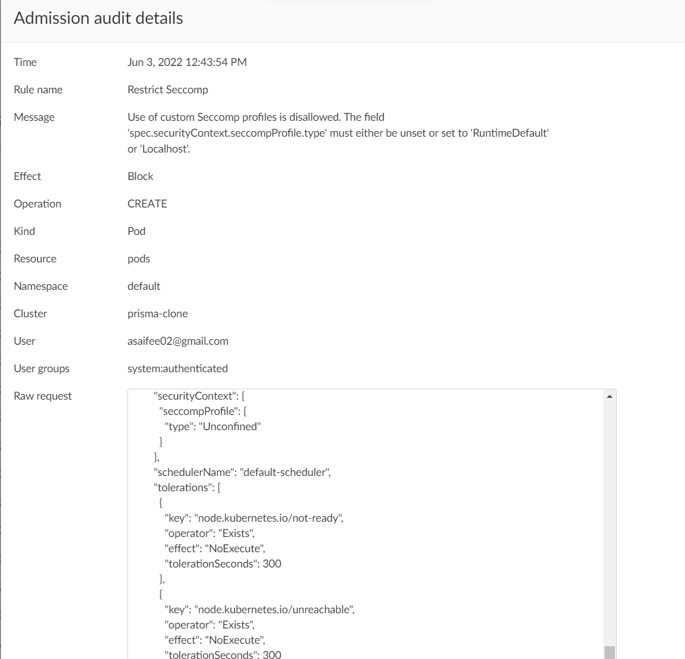

# Table of Contents

- [Open Policy Agent Policies](#open-policy-agent-policies)
  - [1. Disallow Capabilities](#1-disallow-capabilities)
  - [2. Disallow Host Namespaces](#2-disallow-host-namespaces)
  - [3. Disallow hostPath](#3-disallow-hostpath)
  - [4. Disallow hostPorts](#4-disallow-hostports)
  - [5. Disallow hostProcess](#5-disallow-hostprocess)
  - [6. Disallow Privileged Containers](#6-disallow-privileged-containers)
  - [7. Disallow procMount](#7-disallow-procmount)
  - [8. Disallow SELinux](#8-disallow-selinux)
  - [9. Restrict AppArmor](#9-restrict-apparmor)
  - [10. Restrict Seccomp](#10-restrict-seccomp)
  - [11. Restrict sysctls](#11-restrict-sysctls)
  - [12. Disallow images tagged as 'latest'](#12-disallow-images-tagged-as-latest)
  - [13. Disallow pods without resources](#13-disallow-pods-without-resources)
  - [14. Disallow Pods without Probes](#14-disallow-pods-without-probes)
  - [15. Restrict ImagePullPolicy](#15-restrict-imagepullpolicy)
  - [16. Disallow Non-Standard Ports](#16-disallow-non-standard-ports)
  - [17. Exec or Attach to a Pod](#17-exec-or-attach-to-a-pod)
  - [18. Missing Required Labels](#18-missing-required-labels)

---

## Open Policy Agent Policies

### 1. Disallow Capabilities

This policy ensures that adding capabilities beyond those listed in the policy will be disallowed.

Allowed capabilities are:
- `AUDIT_WRITE`
- `CHOWN`
- `DAC_OVERRIDE`
- `FOWNER`
- `FSETID`
- `KILL`
- `MKNOD`
- `NET_BIND_SERVICE`
- `SETFCAP`
- `SETGID`
- `SETPCAP`
- `SETUID`
- `SYS_CHROOT`

<details>
<summary>Rego Policy:</summary>

```rego
match[{"msg": msg}] {
  input.request.kind.kind == "Pod"
  caps := input.request.object.spec[_][_].securityContext.capabilities.add
  capss := { x | x := caps[_] }
  allowed := {"AUDIT_WRITE", "CHOWN", "DAC_OVERRIDE", "FOWNER", "FSETID", "KILL", "MKNOD", "NET_BIND_SERVICE", "SETFCAP", "SETGID", "SETPCAP", "SETUID", "SYS_CHROOT"}
  disallowed := capss - allowed
  count(disallowed) > 0
  msg := sprintf("Capabilities '%v' are not allowed.", [disallowed])
}
```
</details>

<details>
<summary>Unit Tests:</summary>

Run the following command to perform unit tests on this rego policy:

```bash
opa test -zv policies/1-disallow-capabilities.rego unit-tests/1-disallow-capabilities_test.rego
```

Output:

```text
unit-tests/1-disallow-capabilities_test.rego:
data.kubernetes.policies.test_allowed_caps: PASS (1.0006ms)
data.kubernetes.policies.test_container_disallowed_caps: PASS (0s)
data.kubernetes.policies.test_initcontainer_disallowed_caps: PASS (996.3µs)
data.kubernetes.policies.test_disallowed_caps: PASS (0s)
--------------------------------------------------------------------------------
PASS: 4/4
```

</details>

<details>
<summary>Pod YAML for testing the Policy:</summary>

```yaml
apiVersion: v1
kind: Pod
metadata:
  name: nginx
  labels:
    app: nginx
spec:
  containers:
  - name: nginx
    image: nginx
    ports:
    - containerPort: 80
    securityContext:
      capabilities:
        add:
          - "CHOWN"
          - "NET_RAW"
```
</details>

<details>
<summary>Alert generated if policy is violated:</summary>


</details>

---

### 2. Disallow Host Namespaces

Host namespaces (Process ID namespace, Inter-Process Communication namespace, and network namespace) allow access to shared information and can be used to elevate privileges. Pods should not be allowed access to host namespaces. This policy ensures fields which make use of these host namespaces (`spec.hostNetwork`, `spec.hostIPC`, and `spec.hostPID`) are unset or set to `false`.

<details>
<summary>Rego Policy:</summary>

```rego
match[{"msg": msg}] {
  input.request.operation == "CREATE"
  input.request.kind.kind == "Pod"
  input.request.object.spec.hostNetwork
  msg := "The field 'spec.hostNetwork' must be unset or set to 'false'."
}

match[{"msg": msg}] {
  input.request.operation == "CREATE"
  input.request.kind.kind == "Pod"
  input.request.object.spec.hostIPC
  msg := "The field 'spec.hostIPC' must be unset or set to 'false'."
}

match[{"msg": msg}] {
  input.request.operation == "CREATE"
  input.request.kind.kind == "Pod"
  input.request.object.spec.hostPID
  msg := "The field 'spec.hostPID' must be unset or set to 'false'."
}
```
</details>

<details>
<summary>Unit Tests:</summary>

Run the following command to perform unit tests on this rego policy:

```bash
opa test -zv policies/2-disallow-host-ns.rego unit-tests/2-disallow-host-ns_test.rego
```

Output:

```text
unit-tests/2-disallow-host-ns_test.rego:
data.kubernetes.policies.test_host_network: PASS (602.9µs)
data.kubernetes.policies.test_host_ipc: PASS (0s)
data.kubernetes.policies.test_host_pid: PASS (504µs)
data.kubernetes.policies.test_allowed_config: PASS (0s)
data.kubernetes.policies.test_host_network_ipc: PASS (0s)
data.kubernetes.policies.test_host_network_pid: PASS (0s)
data.kubernetes.policies.test_host_ipc_pid: PASS (512.9µs)
--------------------------------------------------------------------------------
PASS: 7/7
```

</details>

<details>
<summary>Pod YAML for testing the Policy:</summary>

```yaml
apiVersion: v1
kind: Pod
metadata:
  name: nginx
  labels:
    app: nginx
spec:
  hostNetwork: true
  containers:
  - name: nginx
    image: nginx
    ports:
    - containerPort: 8081
```
</details>

<details>
<summary>Alert generated if policy is violated:</summary>


</details>

---

### 3. Disallow hostPath

HostPath volumes let Pods use host directories and volumes in containers. Using host resources can be used to access shared data or escalate privileges and should not be allowed. This policy ensures no hostPath volumes (`spec.volumes[*].hostPath`) are in use.

<details>
<summary>Rego Policy:</summary>

```rego
match[{"msg": msg}] {
  input.request.operation == "CREATE"
  input.request.kind.kind == "Pod"
  input.request.object.spec.volumes[_].hostPath
  msg := "HostPath volumes are forbidden. The field 'spec.volumes[*].hostPath' must be unset."
}
```
</details>

<details>
<summary>Unit Tests:</summary>

Run the following command to perform unit tests on this rego policy:

```bash
opa test -zv policies/3-disallow-hostpath.rego unit-tests/3-disallow-hostpath_test.rego
```

Output:

```text
unit-tests/3-disallow-hostpath_test.rego:
data.kubernetes.policies.test_allowed_config: PASS (997µs)
data.kubernetes.policies.test_disallowed_config: PASS (995.9µs)
--------------------------------------------------------------------------------
PASS: 2/2
```

</details>

<details>
<summary>Pod YAML for testing the Policy:</summary>

```yaml
apiVersion: v1
kind: Pod
metadata:
  name: nginx
  labels:
    app: nginx
spec:
  volumes:
    - name: host
      hostPath:
        path: /usr/share/tmp
  containers:
  - name: nginx
    image: nginx
    ports:
    - containerPort: 80
    volumeMounts:
      - name: host
        mountPath: /usr/share/nginx
```
</details>

<details>
<summary>Alert generated if policy is violated:</summary>


</details>

---

### 4. Disallow hostPorts

Access to host ports allows potential snooping of network traffic and should not be allowed, or at minimum restricted to a known list. This policy ensures that the following fields are either unset or set to `0`:
- `spec.containers[*].ports[*].hostPort`
- `spec.initContainers[*].ports[*].hostPort`
- `spec.ephemeralContainers[*].ports[*].hostPort`

<details>
<summary>Rego Policy:</summary>

```rego
match[{"msg": msg}] {
  input.request.operation == "CREATE"
  input.request.kind.kind == "Pod"
  some i,j,k
  input.request.object.spec[i][j].ports[k].hostPort != 0
  msg := sprintf("Use of host ports is disallowed. The field 'spec.%s[%d].ports[%d].hostPort' must be unset or set to '0'.", [i, j, k])
}
```
</details>

<details>
<summary>Pod YAML for testing the Policy:</summary>

```yaml
apiVersion: v1
kind: Pod
metadata:
  name: nginx
  labels:
    app: nginx
spec:
  containers:
  - name: nginx
    image: nginx
    ports:
    - name: http
      containerPort: 80
    - name: test
      containerPort: 8080 
      hostPort: 8080
```
</details>

<details>
<summary>Alert generated if policy is violated:</summary>


</details>

---

### 5. Disallow hostProcess

Windows pods offer the ability to run HostProcess containers which enables privileged access to the Windows node. Privileged access to the host is disallowed in the baseline policy. HostProcess pods are an alpha feature as of Kubernetes v1.22. This policy ensures that the following fields, if present, are set to `false`:
- `spec.securityContext.windowsOptions.hostProcess`
- `spec.containers[*].securityContext.windowsOptions.hostProcess`
- `spec.initContainers[*].securityContext.windowsOptions.hostProcess`
- `spec.ephemeralContainers[*].securityContext.windowsOptions.hostProcess`

<details>
<summary>Rego Policy:</summary>

```rego
match[{"msg": msg}] {
  input.request.operation == "CREATE"
  input.request.kind.kind == "Pod"
  some i,j
  input.request.object.spec[i][j].securityContext.windowsOptions.hostProcess
  msg := sprintf("HostProcess containers are disallowed. The field 'spec.%s[%d].securityContext.windowsOptions.hostProcess' must either be unset or set to 'false'.", [i, j])
}
```
</details>

<details>
<summary>Pod YAML for testing the Policy:</summary>

```yaml
apiVersion: v1
kind: Pod
metadata:
  name: nginx
  labels:
    app: nginx
spec:
  containers:
  - name: nginx
    image: nginx
    ports:
    - containerPort: 80
    securityContext:
      windowsOptions:
        hostProcess: true
```
</details>

<details>
<summary>Alert generated if policy is violated:</summary>

No alerts available as of now.
</details>

---

### 6. Disallow Privileged Containers

Privileged mode disables most security mechanisms and must not be allowed. This policy ensures Pods do not call for privileged mode. This policy enforces that the followings fields must be either unset or set to `false`:
- `spec.containers[*].securityContext.privileged`
- `spec.initContainers[*].securityContext.privileged`

<details>
<summary>Rego Policy:</summary>

```rego
match[{"msg": msg}] {
  input.request.operation == "CREATE"
  input.request.kind.kind == "Pod"
  some i,j
  input.request.object.spec[i][j].securityContext.privileged
  msg := sprintf("Privileged mode is disallowed. The field 'spec.%s[%d].securityContext.privileged' must either be unset or set to 'false'.", [i, j])
}
```
</details>

<details>
<summary>Pod YAML for testing the Policy:</summary>

```yaml
apiVersion: v1
kind: Pod
metadata:
  name: nginx
  labels:
    app: nginx
spec:
  containers:
  - name: nginx
    image: nginx
    ports:
    - containerPort: 80
    securityContext:
      privileged: true
```
</details>

<details>
<summary>Alert generated if policy is violated:</summary>


</details>

---

### 7. Disallow procMount

The default `/proc` masks are set up to reduce attack surface and should be required. This policy ensures nothing but the default procMount can be specified by enforcing that the following fields must either be **unset** or set to `Default`:
- `spec.containers[*].securityContext.procMount`
- `spec.initContainers[*].securityContext.procMount`
- `spec.ephemeralContainers[*].securityContext.procMount`

**NOTE:** In order for users to deviate from the `Default` procMount, [setting a feature gate](https://kubernetes.io/docs/reference/command-line-tools-reference/feature-gates/#:~:text=for%20more%20details.-,ProcMountType,-%3A%20Enables%20control%20over "ProcMountType Feature Gate") at the API server is required.

<details>
<summary>Rego Policy:</summary>

```rego
match[{"msg": msg}] {
  input.request.operation == "CREATE"
  input.request.kind.kind == "Pod"
  some i,j
  input.request.object.spec[i][j].securityContext.procMount != "Default"
  msg := sprintf("Changing the proc mount from the default is not allowed. The field 'spec.%s[%d].securityContext.procMount' must either be unset or set to 'Default'.", [i, j])
}
```
</details>

<details>
<summary>Pod YAML for testing the Policy:</summary>

```yaml
# Note that to deviate from the `Default` procMount requires setting a feature gate at the API server.
apiVersion: v1
kind: Pod
metadata:
  name: nginx
  labels:
    app: nginx
spec:
  containers:
  - name: nginx
    image: nginx
    ports:
    - containerPort: 80
    securityContext:
      procMount: "Unmasked"
```
</details>

<details>
<summary>Alert generated if policy is violated:</summary>

No alerts available as of now.
</details>

---

### 8. Disallow SELinux

SELinux options can be used to escalate privileges and should not be allowed. This policy ensures that the fields:
- `spec.securityContext.seLinuxOptions.type`
- `spec.containers[*].securityContext.seLinuxOptions.type`
- `spec.initContainers[*].securityContext.seLinuxOptions.type`
- `spec.ephemeralContainers[*].securityContext.seLinuxOptions.type`

must either be unset or set to one of the allowed values:
- `container_t`
- `container_init_t`
- `container_kvm_t`

Also, this policy ensures that SELinux `user` and `role` is not set, i.e., the following fields are unset:
- `spec.securityContext.seLinuxOptions.user`
- `spec.securityContext.seLinuxOptions.role`
- `spec.containers[*].securityContext.seLinuxOptions.user`
- `spec.containers[*].securityContext.seLinuxOptions.role`
- `spec.initContainers[*].securityContext.seLinuxOptions.user`
- `spec.initContainers[*].securityContext.seLinuxOptions.role`
- `spec.ephemeralContainers[*].securityContext.seLinuxOptions.user`
- `spec.ephemeralContainers[*].securityContext.seLinuxOptions.role`

<details>
<summary>Rego Policy:</summary>

```rego
match[{"msg": msg}] {
  input.request.operation == "CREATE"
  input.request.kind.kind == "Pod"
  count(input.request.object.spec.securityContext.seLinuxOptions.user) > 0
  msg := "Setting the SELinux user is forbidden. The field 'spec.securityContext.seLinuxOptions.user' must be unset."
}

match[{"msg": msg}] {
  input.request.operation == "CREATE"
  input.request.kind.kind == "Pod"
  some i,j
  count(input.request.object.spec[i][j].securityContext.seLinuxOptions.user) > 0
  msg := sprintf("Setting the SELinux user is forbidden. The field 'spec.%s[%d].securityContext.seLinuxOptions.user' must be unset.", [i, j])
}

match[{"msg": msg}] {
  input.request.operation == "CREATE"
  input.request.kind.kind == "Pod"
  count(input.request.object.spec.securityContext.seLinuxOptions.role) > 0
  msg := "Setting the SELinux role is forbidden. The field 'spec.securityContext.seLinuxOptions.role' must be unset."
}

match[{"msg": msg}] {
  input.request.operation == "CREATE"
  input.request.kind.kind == "Pod"
  some i,j
  count(input.request.object.spec[i][j].securityContext.seLinuxOptions.role) > 0
  msg := sprintf("Setting the SELinux role is forbidden. The field 'spec.%s[%d].securityContext.seLinuxOptions.role' must be unset.", [i, j])
}

match[{"msg": msg}] {
  input.request.operation == "CREATE"
  input.request.kind.kind == "Pod"
  type := { input.request.object.spec.securityContext.seLinuxOptions.type }
  allowed := {"", "container_t", "container_init_t", "container_kvm_t"}
  disallowed := type - allowed
  count(disallowed) > 0
  msg := "Setting the SELinux type is restricted. The field 'spec.securityContext.seLinuxOptions.type' must either be unset or set to one of the allowed values (container_t, container_init_t, or container_kvm_t)."
}

match[{"msg": msg}] {
  input.request.operation == "CREATE"
  input.request.kind.kind == "Pod"
  allowed := {"", "container_t", "container_init_t", "container_kvm_t"}
  some i,j
  type := { input.request.object.spec[i][j].securityContext.seLinuxOptions.type }
  disallowed := type - allowed
  count(disallowed) > 0
  msg := sprintf("Setting the SELinux type is restricted. The field 'spec.%s[%d].securityContext.seLinuxOptions.type' must either be unset or set to one of the allowed values (container_t, container_init_t, or container_kvm_t).", [i, j])
}
```
</details>

<details>
<summary>Pod YAML for testing the Policy:</summary>

```yaml
apiVersion: v1
kind: Pod
metadata:
  name: nginx
  labels:
    app: nginx
spec:
  securityContext:
    seLinuxOptions:
      user: "test"
      role: "admin"
      type: "container_test"
  containers:
  - name: nginx
    image: nginx
    ports:
    - containerPort: 80
    securityContext:
      seLinuxOptions:
        user: "adnan"
        role: "developer"
        type: "container_init_t"
```
</details>

<details>
<summary>Alert generated if policy is violated:</summary>

**Alert generated if SELinux user is set.** 
**Alert generated if SELinux role is set.** 
**Alert generated if SELinux type is set.** 
</details>

---

### 9. Restrict AppArmor

On supported hosts, the `runtime/default` AppArmor profile is applied by default. The default policy should prevent overriding or disabling the policy, or restrict overrides to an allowed set of profiles. This policy ensures Pods do not specify AppArmor profiles other than `runtime/default` or `localhost/*`. That is, the annotation `container.apparmor.security.beta.kubernetes.io` if defined must not be set to anything other than `runtime/default` or `localhost/*`.

<details>
<summary>Rego Policy:</summary>

```rego
match[{"msg": msg}] {
  input.request.operation == "CREATE"
  input.request.kind.kind == "Pod"
  profiles := { x | annot := input.request.object.metadata.annotations[i]; startswith(i, "container.apparmor.security.beta.kubernetes.io/"); annot != "runtime/default"; not startswith(annot, "localhost/"); x := annot }
  count(profiles) > 0
  msg := "Specifying other AppArmor profiles is disallowed. The annotation 'container.apparmor.security.beta.kubernetes.io' if defined must not be set to anything other than 'runtime/default' or 'localhost/*'."
}
```
</details>

<details>
<summary>Pod YAML for testing the Policy:</summary>

```yaml
apiVersion: v1
kind: Pod
metadata:
  name: nginx
  labels:
    app: nginx
  annotations:
    container.apparmor.security.beta.kubernetes.io/nginx: "unconfined"
spec:
  containers:
  - name: nginx
    image: nginx
    ports:
    - containerPort: 80
```
</details>

<details>
<summary>Alert generated if policy is violated:</summary>


</details>

---

### 10. Restrict Seccomp

The seccomp profile must not be explicitly set to `Unconfined`. This policy, requiring Kubernetes v1.19 or later, ensures that seccomp is unset or set to `RuntimeDefault` or `Localhost`. That is, the policy enforces that the following fields must either be unset or set to `RuntimeDefault` or `Localhost`:
- `spec.securityContext.seccompProfile.type`
- `spec.containers[*].securityContext.seccompProfile.type`
- `spec.initContainers[*].securityContext.seccompProfile.type`
- `spec.ephemeralContainers[*].securityContext.seccompProfile.type`

<details>
<summary>Rego Policy:</summary>

```rego
match[{"msg": msg}] {
  input.request.operation == "CREATE"
  input.request.kind.kind == "Pod"
  type := { input.request.object.spec.securityContext.seccompProfile.type }
  allowed := {"", "RuntimeDefault", "Localhost"}
  disallowed := type - allowed
  count(disallowed) > 0
  msg := "Use of custom Seccomp profiles is disallowed. The field 'spec.securityContext.seccompProfile.type' must either be unset or set to 'RuntimeDefault' or 'Localhost'."
}

match[{"msg": msg}] {
  input.request.operation == "CREATE"
  input.request.kind.kind == "Pod"
  allowed := {"", "RuntimeDefault", "Localhost"}
  some i,j
  type := { input.request.object.spec[i][j].securityContext.seccompProfile.type }
  disallowed := type - allowed
  count(disallowed) > 0
  msg := sprintf("Use of custom Seccomp profiles is disallowed. The field 'spec.%s[%d].securityContext.seccompProfile.type' must either be unset or set to 'RuntimeDefault' or 'Localhost'.", [i, j])
}
```
</details>

<details>
<summary>Pod YAML for testing the Policy:</summary>

```yaml
apiVersion: v1
kind: Pod
metadata:
  name: nginx
  labels:
    app: nginx
spec:
  securityContext:
    seccompProfile:
      type: Unconfined
  containers:
  - name: nginx
    image: nginx
    ports:
    - containerPort: 80
    securityContext:
      seccompProfile:
        type: Localhost
        localhostProfile: Nginx
  initContainers:
  - name: redis
    image: redis
    ports:
    - containerPort: 6379
    securityContext:
      seccompProfile:
        type: RuntimeDefault
```
</details>

<details>
<summary>Alert generated if policy is violated:</summary>


</details>

---

### 11. Restrict sysctls

Sysctls can disable security mechanisms or affect all containers on a host, and should be disallowed except for an allowed **"safe"** subset. A sysctl is considered safe if it is namespaced in the container or the Pod, and it is isolated from other Pods or processes on the same Node. This policy ensures that only those **"safe"** subsets can be specified in a Pod. That is, the policy enforces that the field `spec.securityContext.sysctls` must either be unset or not use any other names than the following:
- `kernel.shm_rmid_forced`
- `net.ipv4.ip_local_port_range`
- `net.ipv4.ip_unprivileged_port_start`
- `net.ipv4.tcp_syncookies`
- `net.ipv4.ping_group_range`

<details>
<summary>Rego Policy:</summary>

```rego
match[{"msg": msg}] {
  input.request.operation == "CREATE"
  input.request.kind.kind == "Pod"
  sysctls := { x | x := input.request.object.spec.securityContext.sysctls[_].name }
  allowed := { "kernel.shm_rmid_forced", "net.ipv4.ip_local_port_range", "net.ipv4.ip_unprivileged_port_start", "net.ipv4.tcp_syncookies", "net.ipv4.ping_group_range" }
  disallowed := sysctls - allowed
  count(disallowed) > 0
  msg := sprintf("Setting additional sysctls above the allowed type is disallowed. Please unset the sysctls '%v'. The field 'spec.securityContext.sysctls' must be unset or set to the allowed names - kernel.shm_rmid_forced, net.ipv4.ip_local_port_range, net.ipv4.ip_unprivileged_port_start, net.ipv4.tcp_syncookies and net.ipv4.ping_group_range.", [disallowed])
}
```
</details>

<details>
<summary>Pod YAML for testing the Policy:</summary>

```yaml
apiVersion: v1
kind: Pod
metadata:
  name: nginx
  labels:
    app: nginx
spec:
  securityContext:
    sysctls:
      - name: kernel.shm_rmid_forced
        value: "0"
      - name: net.core.somaxconn
        value: "1024"
      - name: kernel.msgmax
        value: "65536"
  containers:
  - name: nginx
    image: nginx
    ports:
    - containerPort: 80
```
</details>

<details>
<summary>Alert generated if policy is violated:</summary>


</details>

---

### 12. Disallow images tagged as 'latest'

This policy ensures that no container uses an image which is tagged as `latest` or is **untagged**.

<details>
<summary>Rego Policy:</summary>

```rego
requested_images = { img | img := input.request.object.spec[i][j].image }

match[{"msg": msg}] {
  input.request.operation == "CREATE"
  input.request.kind.kind == "Pod"
  ensure
  msg := sprintf("Container(s) '%v' could not be created because it either it's image is tagged as 'latest' or doesn't have a tag.",[input.request.object.spec[i][j].name])
}

ensure {
  has_string(":latest",requested_images)
}
ensure {
  not has_string(":",requested_images)
}

has_string(str,arr){
  contains(arr[_],str)
}
```
</details>

<details>
<summary>Pod YAML for testing the Policy:</summary>

```yaml
apiVersion: v1
kind: Pod
metadata:
  name: nginx
  labels:
    name: nginx
spec:
  initContainers:
    - name: alpine
      image: alpine:3
  containers:
  - name: nginx
    image: nginx
  - name: redis
    image: redis:latest
```
</details>

<details>
<summary>Alert generated if policy is violated:</summary>


</details>

---

### 13. Disallow pods without resources

This policy ensures that every pod specifies resource requests and limits (`cpu` and `memory`) for all of its containers.

<details>
<summary>Rego Policy:</summary>

```rego
match[{"msg": msg}] {
  input.request.operation == "CREATE"
  input.request.kind.kind == "Pod"
  keys := {"containers", "initContainers", "ephemeralContainers"}
  containers := [ c | keys[k]; c := input.request.object.spec[k][_] ]
  container := containers[_]
  missing_resources(container)
  msg := sprintf("Pod '%s' could not be created because it's container '%s' is missing resource requests and limits.", [input.request.object.metadata.name, container.name])
}

missing_resources(container) {
  not container.resources.limits.cpu
}

missing_resources(container) {
  not container.resources.limits.memory
}

missing_resources(container) {
  not container.resources.requests.cpu
}

missing_resources(container) {
  not container.resources.requests.memory
}
```
</details>

<details>
<summary>Pod YAML for testing the Policy:</summary>

```yaml
apiVersion: v1
kind: Pod
metadata:
  name: nginx
  labels:
    name: nginx
spec:
  initContainers:
    - name: alpine
      image: alpine
  containers:
    - name: redis
      image: redis
    - name: nginx
      image: nginx
      resources:
        requests:
          memory: "100Mi"
          cpu: "100m"
        limits:
          memory: "128Mi"
          cpu: "500m"
      ports:
        - containerPort: 80
```
</details>

<details>
<summary>Alert generated if policy is violated:</summary>


</details>

---

### 14. Disallow Pods without Probes

This policy ensures that every container of a pod has `readinessProbe` and `livenessProbe` configurations.

<details>
<summary>Rego Policy:</summary>

```rego
match[{"msg": msg}] {
  input.request.operation == "CREATE"
  input.request.kind.kind == "Pod"
  container := input.request.object.spec.containers[_]
  not container.readinessProbe
  msg := sprintf("Pod '%s' could not be created because it's container '%s' has no readinessProbe configuration.", [input.request.object.metadata.name, container.name])
}

match[{"msg": msg}] {
  input.request.operation == "CREATE"
  input.request.kind.kind == "Pod"
  container := input.request.object.spec.containers[_]
  not container.livenessProbe
  msg := sprintf("Pod '%s' could not be created because it's container '%s' has no livenessProbe configuration.", [input.request.object.metadata.name, container.name])
}
```
</details>

<details>
<summary>Pod YAML for testing the Policy:</summary>

```yaml
apiVersion: v1
kind: Pod
metadata:
  name: nginx
  labels:
    name: nginx
spec:
  containers:
    - name: nginx
      image: nginx
      ports:
        - containerPort: 80
      livenessProbe:
        httpGet:
          path: /
          port: 80
    - name: redis
      image: redis
      ports:
        - containerPort: 3306
      readinessProbe:
        tcpSocket:
          port: 3306
```
</details>

<details>
<summary>Alert generated if policy is violated:</summary>

**Alert generated if readinessProbe is not configured.** 
**Alert generated if livenessProbe is not configured.** 
</details>

---

### 15. Restrict ImagePullPolicy

This policy ensures that every container's `imagePullPolicy` is set to `Always`.

<details>
<summary>Rego Policy:</summary>

```rego
match[{"msg": msg}] {
  input.request.operation == "CREATE"
  input.request.kind.kind == "Pod"
  containers := [ c | input.request.object.spec[i][j].imagePullPolicy != "Always"; c := input.request.object.spec[i][j].name ]
  count(containers) > 0
  msg := sprintf("ImagePullPolicy must be set to 'Always'. Pod '%s' could not be created because imagePullPolicy for the containers '%v' is not set to 'Always'.", [input.request.object.metadata.name, containers])
}
```
</details>

<details>
<summary>Pod YAML for testing the Policy:</summary>

```yaml
apiVersion: v1
kind: Pod
metadata:
  name: nginx
  labels:
    name: nginx
spec:
  initContainers:
    - name: alpine
      image: alpine
      imagePullPolicy: Never
  containers:
    - name: redis
      image: redis
      imagePullPolicy: Always
    - name: nginx
      image: nginx
      imagePullPolicy: IfNotPresent
```
</details>

<details>
<summary>Alert generated if policy is violated:</summary>


</details>

---

### 16. Disallow Non-Standard Ports

This policy ensures that every container in a pod only exposes the standard port (`443`).

<details>
<summary>Rego Policy:</summary>

```rego
match[{"msg": msg}] {
  input.request.operation == "CREATE"
  input.request.kind.kind == "Pod"
  allowed := { 443 }
  total := { p | p := input.request.object.spec[_][_].ports[_].containerPort }
  disallowed := total - allowed
  count(disallowed) > 0
  msg := sprintf("Non-standard containerPorts are disallowed. The ports '%v' must be unset or set to '443'.", [disallowed])
}
```
</details>

<details>
<summary>Pod YAML for testing the Policy:</summary>

```yaml
apiVersion: v1
kind: Pod
metadata:
  name: nginx
spec:
  initContainers:
  - image: redis:latest
    name: redis
    ports:
    - containerPort: 443
    - containerPort: 80
  containers:
  - image: nginx
    name: nginx
    ports:
    - containerPort: 443
    - containerPort: 81
  - image: alpine
    name: alpine
    ports:
    - containerPort: 443
    - containerPort: 82
```
</details>

<details>
<summary>Alert generated if policy is violated:</summary>


</details>

---

### 17. Exec or Attach to a Pod

This policy detects an exec or attach event for a Pod.

<details>
<summary>Rego Policy:</summary>

```rego
match[{"msg": msg}]{
  input.request.operation == "CONNECT"
  input.request.resource.resource == "pods"
  pod := input.request.name
  container := input.request.object.container
  exec_or_attach(input.request.subResource)
  msg := sprintf("Exec or attach to the container '%s' of pod '%s' detected.", [container, pod])
}

exec_or_attach(v) {
  v == "exec"
}

exec_or_attach(v) {
  v == "attach"
}
```
</details>

<details>
<summary>Pod YAML for testing the Policy:</summary>

```yaml
apiVersion: v1
kind: Pod
metadata:
  name: nginx
  labels:
    name: nginx
spec:
  containers:
  - name: nginx
    image: nginx
```
</details>

<details>
<summary>Alert generated if policy is violated:</summary>


</details>

---

### 18. Missing Required Labels

This policy ensures that a Pod has all the required labels.

<details>
<summary>Rego Policy:</summary>

```rego
match[{"msg": msg}]{
  operations := {"CREATE", "UPDATE"}
  operations[input.request.operation]
  input.request.kind.kind == "Pod"
  pod := input.request.object.metadata.name
  pod_labels := { l | input.request.object.metadata.labels[l] }
  required_labels := { "kubernetes.io/app", "env" }
  missing := required_labels - pod_labels
  count(missing) > 0
  msg := sprintf("Pod '%s' is missing the required labels '%v'.", [pod, missing])
}
```
</details>

<details>
<summary>Unit Tests:</summary>

Run the following command to perform unit tests on this rego policy:

```bash
opa test -zv policies/18-missing-required-labels.rego unit-tests/18-missing-required-labels_test.rego
```

Output:

```text
unit-tests/18-missing-required-labels_test.rego:
data.kubernetes.policies.test_all_present: PASS (1.0281ms)
data.kubernetes.policies.test_env_missing: PASS (0s)
data.kubernetes.policies.test_app_missing: PASS (0s)
data.kubernetes.policies.test_all_missing: PASS (965.2µs)
--------------------------------------------------------------------------------
PASS: 4/4
```

</details>

<details>
<summary>Pod YAML for testing the Policy:</summary>

```yaml
apiVersion: v1
kind: Pod
metadata:
  name: nginx
  labels:
    name: nginx
    env: prod
spec:
  containers:
  - name: nginx
    image: nginx
```
</details>

<details>
<summary>Alert generated if policy is violated:</summary>


</details>

---
