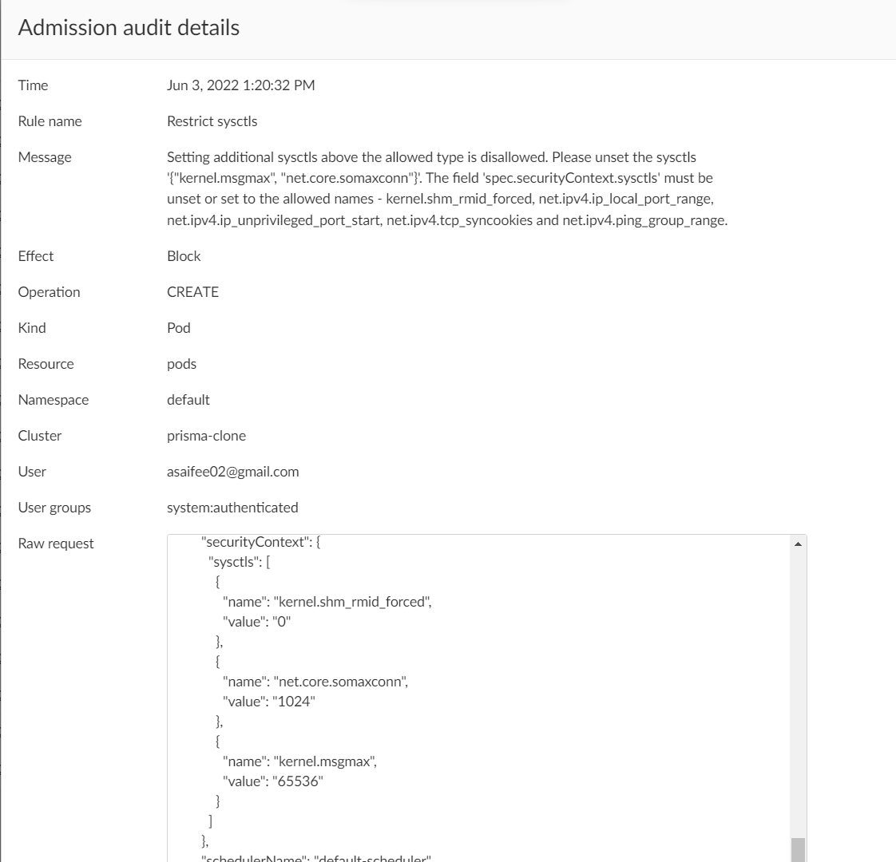

## Restrict sysctls

Sysctls can disable security mechanisms or affect all containers on a host, and should be disallowed except for an allowed **"safe"** subset. A sysctl is considered safe if it is namespaced in the container or the Pod, and it is isolated from other Pods or processes on the same Node. This policy ensures that only those **"safe"** subsets can be specified in a Pod. That is, the policy enforces that the field `spec.securityContext.sysctls` must either be unset or not use any other names than the following:
- `kernel.shm_rmid_forced`
- `net.ipv4.ip_local_port_range`
- `net.ipv4.ip_unprivileged_port_start`
- `net.ipv4.tcp_syncookies`
- `net.ipv4.ping_group_range`

**Rego Policy:**

```rego
match[{"msg": msg}] {
  operations := { "CREATE", "UPDATE" }
  operations[input.request.operation]
  input.request.kind.kind == "Pod"
  sysctls := { x | x := input.request.object.spec.securityContext.sysctls[_].name }
  allowed := { "kernel.shm_rmid_forced", "net.ipv4.ip_local_port_range", "net.ipv4.ip_unprivileged_port_start", "net.ipv4.tcp_syncookies", "net.ipv4.ping_group_range" }
  disallowed := sysctls - allowed
  count(disallowed) > 0
  page := "https://learningcicd.github.io/11-restrict-sysctls.html"
  msg := sprintf("Setting additional sysctls above the allowed type is disallowed. Please unset the sysctls '%v'. The field 'spec.securityContext.sysctls' must be unset or set to the allowed names. For more information, please visit %s.", [disallowed, page])
}```

**Pod YAML for testing the Policy:**

```yaml
apiVersion: v1
kind: Pod
metadata:
  name: nginx
  labels:
    app: nginx
spec:
  securityContext:
    sysctls:
      - name: kernel.shm_rmid_forced
        value: "0"
      - name: net.core.somaxconn
        value: "1024"
      - name: kernel.msgmax
        value: "65536"
  containers:
  - name: nginx
    image: nginx
    ports:
    - containerPort: 80
```

**Alert generated if policy is violated:**



**Remediation:**

Make sure that a Pod only uses the ***safe*** sysctls. That is, the field `spec.securityContext.sysctls` must either be unset or set to one of `kernel.shm_rmid_forced`, `net.ipv4.ip_local_port_range`, `net.ipv4.ip_unprivileged_port_start`, `net.ipv4.tcp_syncookies` or `net.ipv4.ping_group_range`.

An example POD yaml file which will violate the policy is given below along with remediation.

```yaml
apiVersion: v1
kind: Pod
metadata:
  name: demo11
spec:
  securityContext:
    sysctls:
      - name: kernel.shm_rmid_forced  # <- This sysctl is allowed
        value: "0"
      - name: net.core.somaxconn  # <- This sysctl is not allowed. It must be removed
        value: "1024"
  containers:
  - name: nginx
    image: nginx
```

---
