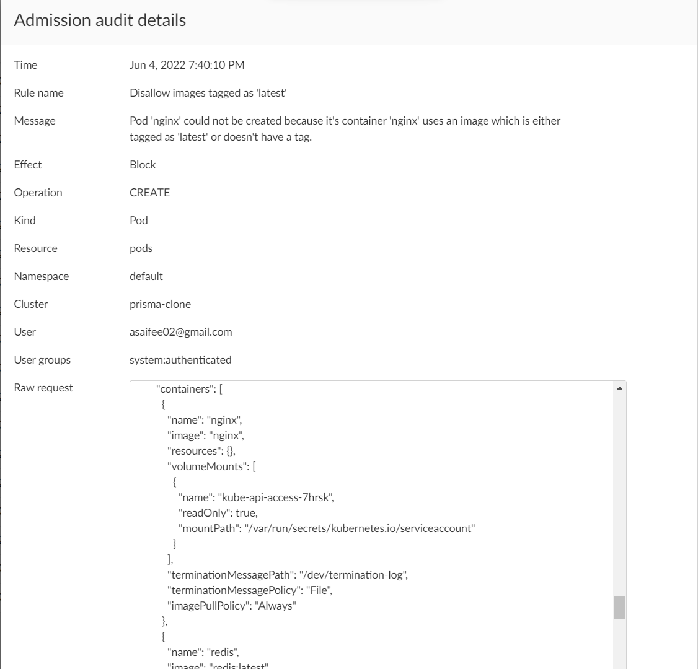

## Disallow images tagged as 'latest'

This policy ensures that no container uses an image which is tagged as `latest` or is `untagged`.

**Rego Policy:**

```rego
match[{"msg": msg}] {
  operations := { "CREATE", "UPDATE" }
  operations[input.request.operation]
  input.request.kind.kind == "Pod"
  container := input.request.object.spec.containers
  initContainer := input.request.object.spec.initContainers
  c_images := { c | img := container[i].image; ensure(img); c := container[i].name }
  ic_images := { ic | img := initContainer[_].image; ensure(img); ic := initContainer[i].name }
  images := c_images | ic_images
  count(images) > 0
  page := "https://learningcicd.github.io/12-disallow-images-tagged-as-latest.html"
  msg := sprintf("Container(s) '[%s]' could not be created because either their image is tagged as 'latest' or doesn't have a tag. For more information, please visit %s.",[concat(", ", images), page])
}

ensure(img) {
  contains(img, ":latest")
}

ensure(img) {
  not contains(img, ":")
}
```

**Pod YAML for testing the Policy:**

```yaml
apiVersion: v1
kind: Pod
metadata:
  name: nginx
  labels:
    name: nginx
spec:
  initContainers:
    - name: alpine
      image: alpine:3
  containers:
  - name: nginx
    image: nginx
  - name: redis
    image: redis:latest
```

**Alert generated if policy is violated:**



**Remediation:**

Make sure that no container uses an image which is tagged as `latest` or is `untagged`. An example POD yaml file which will violate the policy is given below along with remediation.

```yaml
apiVersion: v1
kind: Pod
metadata:
  name: demo12
spec:
  initContainers:
    - name: alpine
      image: alpine:3 # <- This image is allowed
  containers:
  - name: nginx
    image: nginx  # <- This image is untagged, hence it is not allowed. Use a different image.
  - name: redis
    image: redis:latest  # <- This image is tagged as 'latest', hence it is not allowed. Use a different image.
```

---
