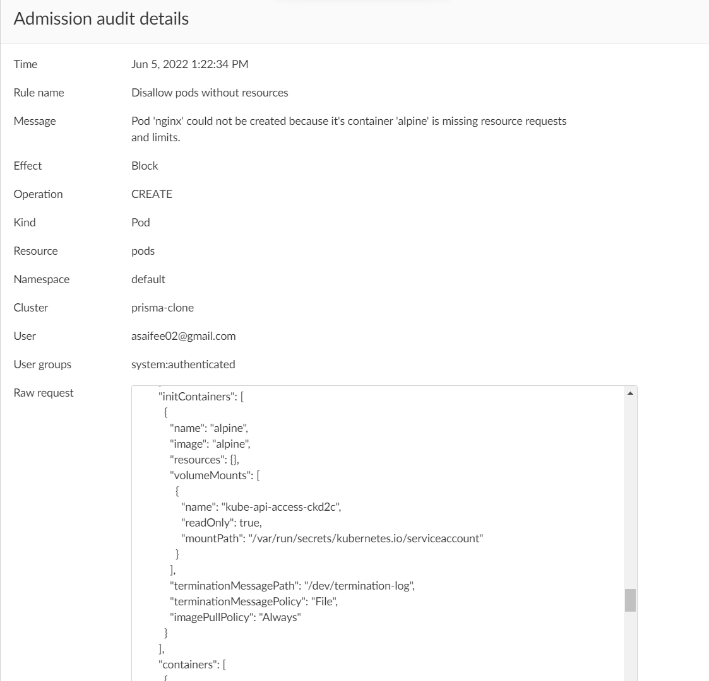

## Disallow pods without resources

This policy ensures that every pod specifies resource requests and limits (`cpu` and `memory`) for all of its containers.

**Rego Policy:**

```rego
match[{"msg": msg}] {
  operations := { "CREATE", "UPDATE" }
  operations[input.request.operation]
  input.request.kind.kind == "Pod"
  name := input.request.object.metadata.name
  container := input.request.object.spec.containers
  initContainer := input.request.object.spec.initContainers
  check1 := { c | missing_resources(container[i]); c := container[i].name }
  check2 := { ic | missing_resources(initContainer[i]); ic := initContainer[i].name }
  check := check1 | check2
  count(check) > 0
  page := "https://learningcicd.github.io/13-disallow-pods-without-resources.html"
  msg := sprintf("Pod '%s' could not be created because its container(s) '[%s]' are missing resource requests and limits. For more information, please visit %s.", [name, concat(", ", check), page])
}

missing_resources(container) {
  not container.resources.limits.cpu
}

missing_resources(container) {
  not container.resources.limits.memory
}

missing_resources(container) {
  not container.resources.requests.cpu
}

missing_resources(container) {
  not container.resources.requests.memory
}```

**Pod YAML for testing the Policy:**

```yaml
apiVersion: v1
kind: Pod
metadata:
  name: nginx
  labels:
    name: nginx
spec:
  initContainers:
    - name: alpine
      image: alpine
  containers:
    - name: redis
      image: redis
    - name: nginx
      image: nginx
      resources:
        requests:
          memory: "100Mi"
          cpu: "100m"
        limits:
          memory: "128Mi"
          cpu: "500m"
      ports:
        - containerPort: 80
```

**Alert generated if policy is violated:**



**Remediation:**

Make sure that every container specifies resource requests and limits (`cpu` and `memory`). That is, the fields `resources.requests.memory`, `resources.requests.cpu`, `resources.limits.memory` and `resources.limits.cpu` are set for each and every container inside a POD.

An example POD yaml file which will violate the policy is given below along with remediation.

```yaml
apiVersion: v1
kind: Pod
metadata:
  name: demo13
spec:
  initContainers:
    # The 'alpine' container is not allowed as it does not specify resource requests and limits.
    - name: alpine
      image: alpine:3
  containers:
  # The 'nginx' container is allowed as it has specified resource requests and limits.
  - name: nginx
    image: nginx
    resources:
      requests:
        memory: "100Mi"
        cpu: "100m"
      limits:
        memory: "128Mi"
        cpu: "500m"
```

---
