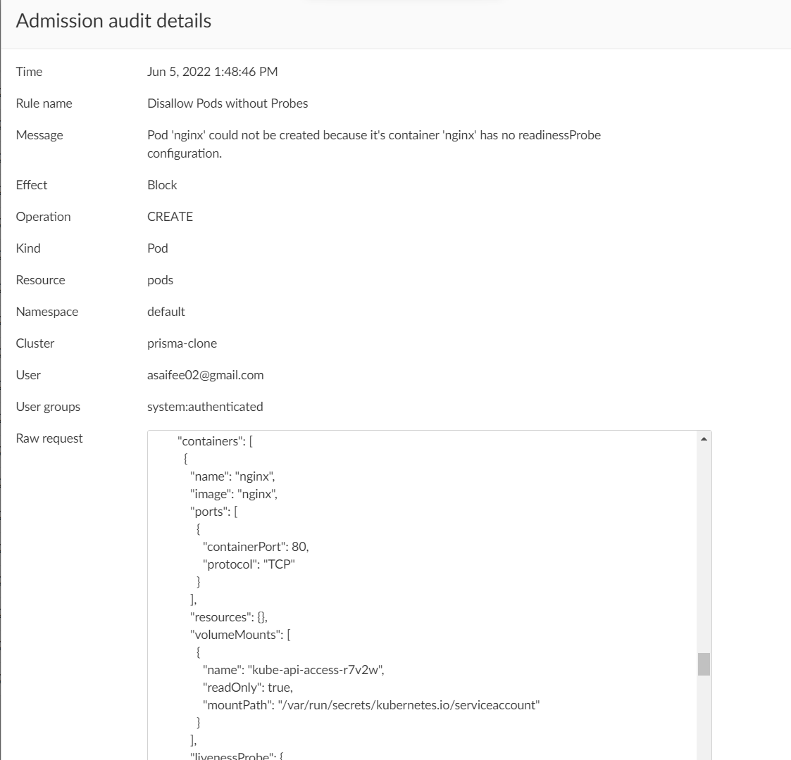
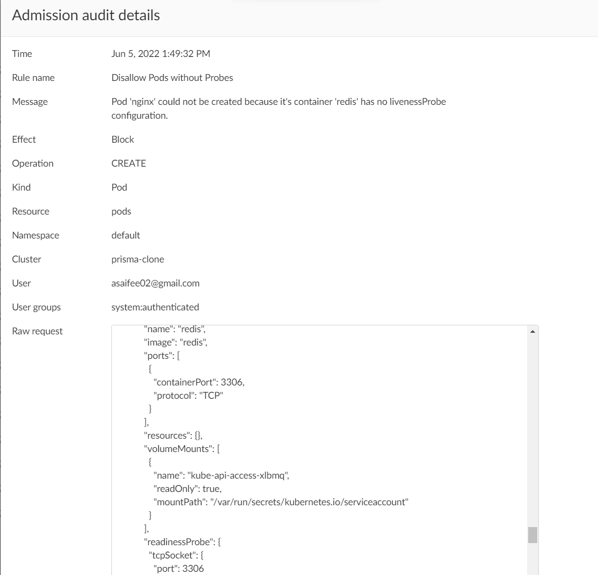

## Disallow Pods without Probes

This policy ensures that every container of a pod has `readinessProbe` and `livenessProbe` configurations.

**Rego Policy:**

```rego
match[{"msg": msg}] {
  operations := { "CREATE", "UPDATE" }
  operations[input.request.operation]
  input.request.kind.kind == "Pod"
  name := input.request.object.metadata.name
  container := input.request.object.spec.containers
  initContainer := input.request.object.spec.initContainers
  check1 := { c | not container[i].readinessProbe; c := container[i].name }
  check2 := { ic | not initContainer[i].readinessProbe; ic := initContainer[i].name }
  check := check1 | check2
  count(check) > 0
  page := "https://learningcicd.github.io/14-disallow-pods-without-probes.html"
  msg := sprintf("Pod '%s' could not be created because its container(s) '[%s]' have no readinessProbe configuration. For more information, please visit %s.", [name, concat(", ", check), page])
}

match[{"msg": msg}] {
  operations := { "CREATE", "UPDATE" }
  operations[input.request.operation]
  input.request.kind.kind == "Pod"
  name := input.request.object.metadata.name
  container := input.request.object.spec.containers
  initContainer := input.request.object.spec.initContainers
  check1 := { c | not container[i].livenessProbe; c := container[i].name }
  check2 := { ic | not initContainer[i].livenessProbe; ic := initContainer[i].name }
  check := check1 | check2
  count(check) > 0
  page := "https://learningcicd.github.io/14-disallow-pods-without-probes.html"
  msg := sprintf("Pod '%s' could not be created because its container(s) '[%s]' have no livenessProbe configuration. For more information, please visit %s.", [name, concat(", ", check), page])
}
```

**Pod YAML for testing the Policy:**

```yaml
apiVersion: v1
kind: Pod
metadata:
  name: nginx
  labels:
    name: nginx
spec:
  containers:
    - name: nginx
      image: nginx
      ports:
        - containerPort: 80
      livenessProbe:
        httpGet:
          path: /
          port: 80
    - name: redis
      image: redis
      ports:
        - containerPort: 3306
      readinessProbe:
        tcpSocket:
          port: 3306
```

**Alerts generated if policy is violated:**

1. **Alert generated if readinessProbe is not configured.** 
2. **Alert generated if livenessProbe is not configured.** 

**Remediation:**

Make sure that every container in a POD specifies `readinessProbe` and `livenessProbe` configurations. These configurations help in determining whether a container is healthy (working) or not.

An example POD yaml file which will violate the policy is given below along with remediation.

```yaml
apiVersion: v1
kind: Pod
metadata:
  name: demo14
spec:
  containers:
    # The 'nginx' container is not allowed as it does not specify 'readinessProbe' configuration.
    - name: nginx
      image: nginx
      ports:
        - containerPort: 80
      livenessProbe:
        httpGet:
          path: /
          port: 80
    
    # The 'redis' container is not allowed as it does not specify 'livenessProbe' configuration.
    - name: redis
      image: redis
      ports:
        - containerPort: 3306
      readinessProbe:
        tcpSocket:
          port: 3306
```

---
