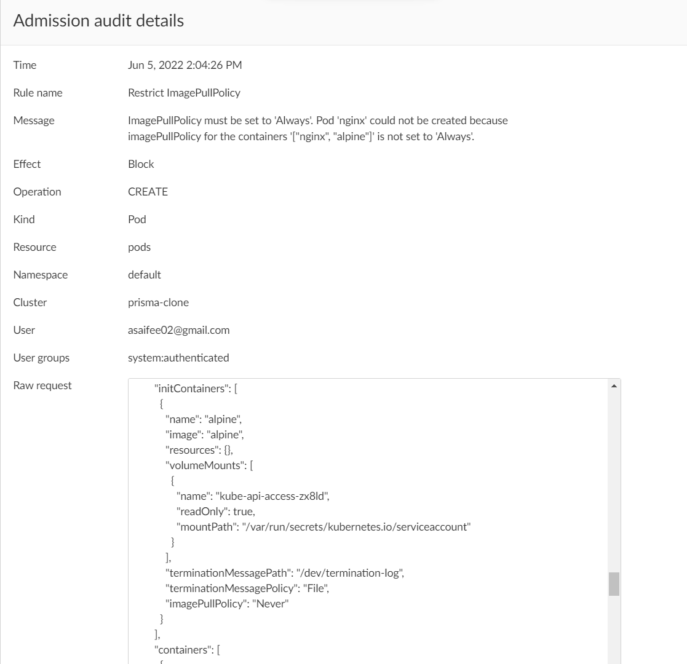

## Restrict ImagePullPolicy

This policy ensures that every container's `imagePullPolicy` is set to `Always`.

**Rego Policy:**

```rego
match[{"msg": msg}] {
  operations := { "CREATE", "UPDATE" }
  operations[input.request.operation]
  input.request.kind.kind == "Pod"
  name := input.request.object.metadata.name
  container := input.request.object.spec.containers
  initContainer := input.request.object.spec.initContainers
  check1 := { c | container[i].imagePullPolicy != "Always"; c := container[i].name }
  check2 := { c | initContainer[i].imagePullPolicy != "Always"; c := initContainer[i].name }
  check := check1 | check2
  count(check) > 0
  page := "https://learningcicd.github.io/15-restrict-imagepullpolicy.html"
  msg := sprintf("ImagePullPolicy must be set to 'Always'. Pod '%s' could not be created because imagePullPolicy for the containers '[%s]' is not set to 'Always'. For more information, please visit %s.", [name, concat(", ", check), page])
}
```

**Pod YAML for testing the Policy:**

```yaml
apiVersion: v1
kind: Pod
metadata:
  name: nginx
  labels:
    name: nginx
spec:
  initContainers:
    - name: alpine
      image: alpine
      imagePullPolicy: Never
  containers:
    - name: redis
      image: redis
      imagePullPolicy: Always
    - name: nginx
      image: nginx
      imagePullPolicy: IfNotPresent
```

**Alert generated if policy is violated:**



**Remediation:**

Make sure that every container's `imagePullPolicy` field is set to `Always`. The values `IfNotPresent` and `Never` for `imagePullPolicy` are not allowed.

An example POD yaml file which will violate the policy is given below along with remediation.

```yaml
apiVersion: v1
kind: Pod
metadata:
  name: demo15
spec:
  containers:
    - name: redis
      image: redis
      imagePullPolicy: Always # <- This value is allowed
    - name: nginx
      image: nginx
      imagePullPolicy: IfNotPresent # <- The value 'IfNotPresent' is not allowed. It must be set to 'Always'
    - name: alpine
      image: alpine
      imagePullPolicy: Never  # <- The value 'Never' is not allowed. It must be set to 'Always'
```

---
