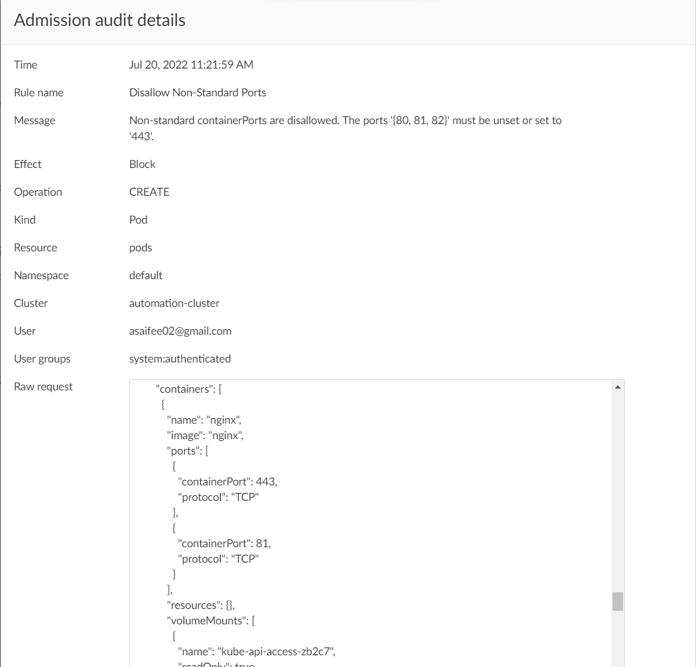

## Disallow Non-Standard Ports

This policy ensures that every container in a pod only exposes the standard port (`443`).

**Rego Policy:**

```rego
match[{"msg": msg}] {
  operations := { "CREATE", "UPDATE" }
  operations[input.request.operation]
  input.request.kind.kind == "Pod"
  allowed := { 443 }
  check1 := { p | p := input.request.object.spec.containers[_].ports[_].containerPort }
  check2 := { p | p := input.request.object.spec.initContainers[_].ports[_].containerPort }
  ports := check1 | check2
  check := ports - allowed
  count(check) > 0
  page := "https://learningcicd.github.io/16-disallow-non-standard-ports.html"
  msg := sprintf("Non-standard containerPorts are disallowed. The containerPorts '[%s]' must be unset or set to '443'. For more information, please visit %s.", [check, page])
}
```

**Pod YAML for testing the Policy:**

```yaml
apiVersion: v1
kind: Pod
metadata:
  name: nginx
spec:
  initContainers:
  - image: redis:latest
    name: redis
    ports:
    - containerPort: 443
    - containerPort: 80
  containers:
  - image: nginx
    name: nginx
    ports:
    - containerPort: 443
    - containerPort: 81
  - image: alpine
    name: alpine
    ports:
    - containerPort: 443
    - containerPort: 82
```

**Alert generated if policy is violated:**



**Remediation:**

Make sure that every container in a pod only exposes the standard port (`443`). That is, the field `ports[*].containerPort` for every container must either be unset or set to `443`.

An example POD yaml file which will violate the policy is given below along with remediation.

```yaml
apiVersion: v1
kind: Pod
metadata:
  name: demo16
spec:
  containers:
  - image: nginx
    name: nginx
    ports:
    - containerPort: 443  # <- This value is allowed
  - image: alpine
    name: alpine
    ports:
    - containerPort: 80  # <- This value is not allowed. It must either be set to '443' or removed
```

---
