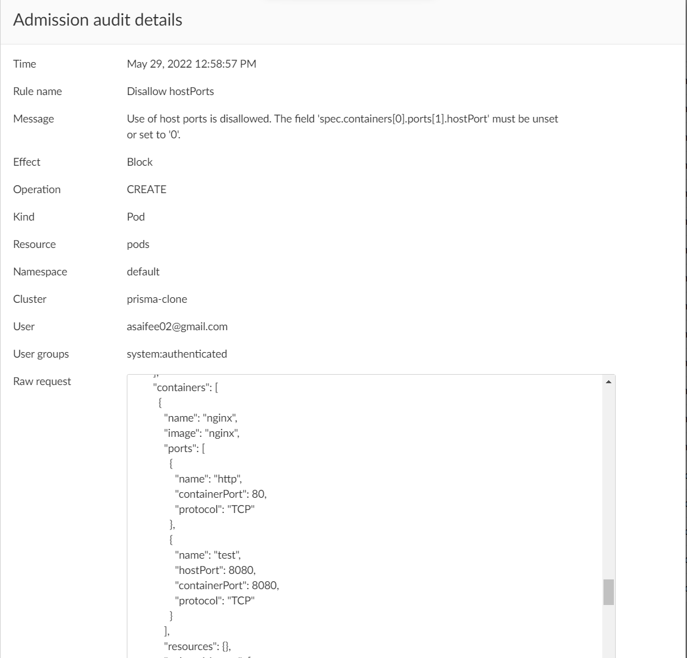

## Disallow hostPorts

Access to host ports allows potential snooping of network traffic and should not be allowed, or at minimum restricted to a known list. This policy ensures that the following fields are either unset or set to `0`:
- `spec.containers[*].ports[*].hostPort`
- `spec.initContainers[*].ports[*].hostPort`
- `spec.ephemeralContainers[*].ports[*].hostPort`

**Rego Policy:**

```rego
match[{"msg": msg}] {
  operations := { "CREATE", "UPDATE" }
  operations[input.request.operation]
  input.request.kind.kind == "Pod"
  ports1 := { p | p := input.request.object.spec.containers[_].ports[_].hostPort; p != 0 }
  ports2 := { p | p := input.request.object.spec.initContainers[_].ports[_].hostPort; p != 0 }
  ports := ports1 | ports2
  count(ports) > 0
  page := "https://learningcicd.github.io/4-disallow-hostports.html"
  msg := sprintf("Use of host ports is disallowed. The hostPorts '%v' must be unset or set to '0'. For more information, please visit %s.", [ports, page])
}
```

**Pod YAML for testing the Policy:**

```yaml
apiVersion: v1
kind: Pod
metadata:
  name: nginx
  labels:
    app: nginx
spec:
  containers:
  - name: nginx
    image: nginx
    ports:
    - name: http
      containerPort: 80
    - name: test
      containerPort: 8080 
      hostPort: 8080
```

**Alert generated if policy is violated:**



**Remediation:**

Make sure that a container does not use hostPorts, i.e., the field `ports[*].hostPort` is unset. An example POD yaml file which will violate the policy is given below along with remediation.

```yaml
apiVersion: v1
kind: Pod
metadata:
  name: demo4
spec:
  containers:
  - name: nginx
    image: nginx
    ports:
    - name: http
      containerPort: 80
      hostPort: 8080  # <- This field must be removed or set to '0'
```

---
