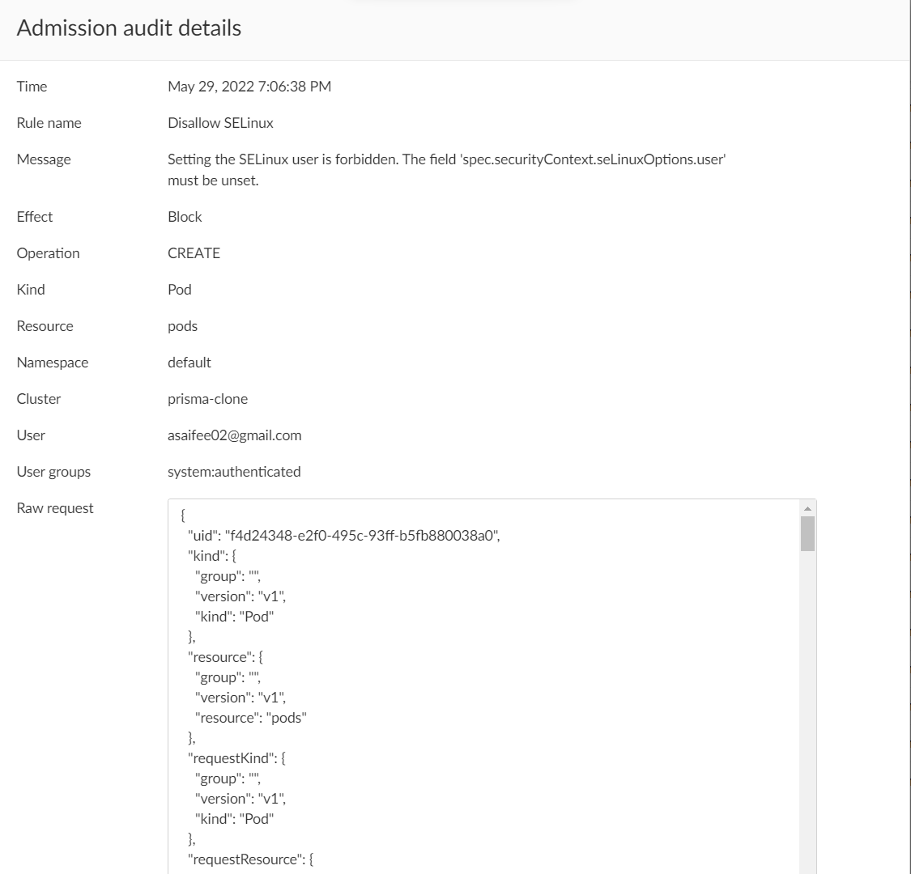

## Disallow SELinux

SELinux options can be used to escalate privileges and should not be allowed. This policy ensures that the fields:
- `spec.securityContext.seLinuxOptions.type`
- `spec.containers[*].securityContext.seLinuxOptions.type`
- `spec.initContainers[*].securityContext.seLinuxOptions.type`
- `spec.ephemeralContainers[*].securityContext.seLinuxOptions.type`

must either be unset or set to one of the allowed values:
- `container_t`
- `container_init_t`
- `container_kvm_t`

Also, this policy ensures that SELinux `user` and `role` is not set, i.e., the following fields are unset:
- `spec.securityContext.seLinuxOptions.user`
- `spec.securityContext.seLinuxOptions.role`
- `spec.containers[*].securityContext.seLinuxOptions.user`
- `spec.containers[*].securityContext.seLinuxOptions.role`
- `spec.initContainers[*].securityContext.seLinuxOptions.user`
- `spec.initContainers[*].securityContext.seLinuxOptions.role`
- `spec.ephemeralContainers[*].securityContext.seLinuxOptions.user`
- `spec.ephemeralContainers[*].securityContext.seLinuxOptions.role`

**Rego Policy:**

```rego
match[{"msg": msg}] {
  operations := { "CREATE", "UPDATE" }
  operations[input.request.operation]
  input.request.kind.kind == "Pod"
  count(input.request.object.spec.securityContext.seLinuxOptions.user) > 0
  page := "https://learningcicd.github.io/8-disallow-selinux.html"
  msg := sprintf("Setting the SELinux user is forbidden. The field 'spec.securityContext.seLinuxOptions.user' must be unset.", [page])
}

match[{"msg": msg}] {
  operations := { "CREATE", "UPDATE" }
  operations[input.request.operation]
  input.request.kind.kind == "Pod"
  check1 := { c | p := input.request.object.spec.containers[i].securityContext.seLinuxOptions.user; count(p) > 0; c := input.request.object.spec.containers[i].name }
  check2 := { c | p := input.request.object.spec.initContainers[i].securityContext.seLinuxOptions.user; count(p) > 0; c := input.request.object.spec.initContainers[i].name }
  check := check1 | check2
  count(check) > 0
  page := "https://learningcicd.github.io/8-disallow-selinux.html"
  msg := sprintf("Setting the SELinux user is forbidden. The field 'securityContext.seLinuxOptions.user' must be unset for the containers '[%s]'. For more information, please visit %s.", [concat(", ", check), page])
}

match[{"msg": msg}] {
  operations := { "CREATE", "UPDATE" }
  operations[input.request.operation]
  input.request.kind.kind == "Pod"
  count(input.request.object.spec.securityContext.seLinuxOptions.role) > 0
  page := "https://learningcicd.github.io/8-disallow-selinux.html"
  msg := sprintf("Setting the SELinux role is forbidden. The field 'spec.securityContext.seLinuxOptions.role' must be unset. For more information, please visit %s.", [page])
}

match[{"msg": msg}] {
  operations := { "CREATE", "UPDATE" }
  operations[input.request.operation]
  input.request.kind.kind == "Pod"
  check1 := { c | p := input.request.object.spec.containers[i].securityContext.seLinuxOptions.role; count(p) > 0; c := input.request.object.spec.containers[i].name }
  check2 := { c | p := input.request.object.spec.initContainers[i].securityContext.seLinuxOptions.role; count(p) > 0; c := input.request.object.spec.initContainers[i].name }
  check := check1 | check2
  count(check) > 0
  page := "https://learningcicd.github.io/8-disallow-selinux.html"
  msg := sprintf("Setting the SELinux role is forbidden. The field 'securityContext.seLinuxOptions.role' must be unset for the containers '[%s]'. For more information, please visit %s.", [concat(", ", check), page])
}

match[{"msg": msg}] {
  operations := { "CREATE", "UPDATE" }
  operations[input.request.operation]
  input.request.kind.kind == "Pod"
  allowed := {"", "container_t", "container_init_t", "container_kvm_t"}
  not allowed[input.request.object.spec.securityContext.seLinuxOptions.type]
  page := "https://learningcicd.github.io/8-disallow-selinux.html"
  msg := sprintf("Setting the SELinux type is restricted. The field 'spec.securityContext.seLinuxOptions.type' must either be unset or set to one of the allowed values (container_t, container_init_t, or container_kvm_t). For more information, please visit %s.", [page])
}

match[{"msg": msg}] {
  operations := { "CREATE", "UPDATE" }
  operations[input.request.operation]
  input.request.kind.kind == "Pod"
  allowed := {"", "container_t", "container_init_t", "container_kvm_t"}
  check1 := { c | p := input.request.object.spec.containers[i].securityContext.seLinuxOptions.type; not allowed[p]; c := input.request.object.spec.containers[i].name }
  check2 := { c | p := input.request.object.spec.initContainers[i].securityContext.seLinuxOptions.type; not allowed[p]; c := input.request.object.spec.initContainers[i].name }
  check := check1 | check2
  count(check) > 0
  page := "https://learningcicd.github.io/8-disallow-selinux.html"
  msg := sprintf("Setting the SELinux type is restricted. The field 'securityContext.seLinuxOptions.type' for the containers '[%s]' must either be unset or set to one of the allowed values (container_t, container_init_t, or container_kvm_t). For more information, please visit %s.", [concat(", ", check), page])
}
```

**Pod YAML for testing the Policy:**

```yaml
apiVersion: v1
kind: Pod
metadata:
  name: nginx
  labels:
    app: nginx
spec:
  securityContext:
    seLinuxOptions:
      user: "test"
      role: "admin"
      type: "container_test"
  containers:
  - name: nginx
    image: nginx
    ports:
    - containerPort: 80
    securityContext:
      seLinuxOptions:
        user: "adnan"
        role: "developer"
        type: "container_init_t"
```

**Alerts generated if policy is violated:**

1. **Alert generated if SELinux user is set.** 
2. **Alert generated if SELinux role is set.** 
3. **Alert generated if SELinux type is set.** 

**Remediation:**

Make sure that a container or a POD do not use a SELinux `user` or `role`. That is, the fields `securityContext.seLinuxOptions.user` and `securityContext.seLinuxOptions.role` must not be set for a container or POD.

Also make sure that the SELinux type used by a POD or container belongs to the allowed values. That is, the field `securityContext.seLinuxOptions.type` must either be unset or set to one of `container_t`, `container_init_t` or `container_kvm_t`.

An example POD yaml file which will violate the policy is given below along with remediation.

```yaml
apiVersion: v1
kind: Pod
metadata:
  name: demo8
spec:
  securityContext:
    seLinuxOptions:
      user: "test1"  # <- This field must be removed
      role: "admin" # <- This field must be removed
      type: "container_test1"  # <- This field must be removed or set to one of the allowed values
  containers:
  - name: nginx
    image: nginx
    securityContext:
      seLinuxOptions:
        user: "test2" # <- This field must be removed
        role: "developer" # <- This field must be removed
        type: "container_test2"  # <- This field must be removed or set to one of the allowed values
```

---
