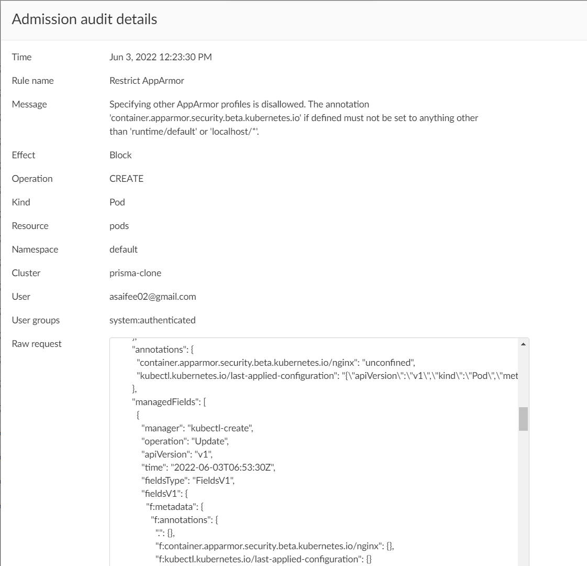

## Restrict AppArmor

On supported hosts, the `runtime/default` AppArmor profile is applied by default. The default policy should prevent overriding or disabling the policy, or restrict overrides to an allowed set of profiles. This policy ensures Pods do not specify AppArmor profiles other than `runtime/default` or `localhost/*`. That is, the annotation `container.apparmor.security.beta.kubernetes.io` if defined must not be set to anything other than `runtime/default` or `localhost/*`.

**Rego Policy:**

```rego
match[{"msg": msg}] {
  operations := { "CREATE", "UPDATE" }
  operations[input.request.operation]
  input.request.kind.kind == "Pod"
  profiles := { x | annot := input.request.object.metadata.annotations[i]; startswith(i, "container.apparmor.security.beta.kubernetes.io/"); annot != "runtime/default"; not startswith(annot, "localhost/"); x := annot }
  count(profiles) > 0
  page := "https://learningcicd.github.io/9-restrict-apparmor.html"
  msg := sprintf("Specifying other AppArmor profiles is disallowed. The annotation 'container.apparmor.security.beta.kubernetes.io' if defined must not be set to anything other than 'runtime/default' or 'localhost/*'. For more information, please visit %s.", [page])
}
```

**Pod YAML for testing the Policy:**

```yaml
apiVersion: v1
kind: Pod
metadata:
  name: nginx
  labels:
    app: nginx
  annotations:
    container.apparmor.security.beta.kubernetes.io/nginx: "unconfined"
spec:
  containers:
  - name: nginx
    image: nginx
    ports:
    - containerPort: 80
```

**Alert generated if policy is violated:**



**Remediation:**

Make sure that Pods do not specify AppArmor profiles other than `runtime/default` or `localhost/*`. That is, the annotation `container.apparmor.security.beta.kubernetes.io` if defined must not be set to anything other than `runtime/default` or `localhost/*`.

An example POD yaml file which will violate the policy is given below along with remediation.

```yaml
apiVersion: v1
kind: Pod
metadata:
  name: demo9
  annotations:
    # Either remove this annotation or set it's value to one of the allowed values.
    container.apparmor.security.beta.kubernetes.io/nginx: "unconfined"
spec:
  containers:
  - name: nginx
    image: nginx
```

---
